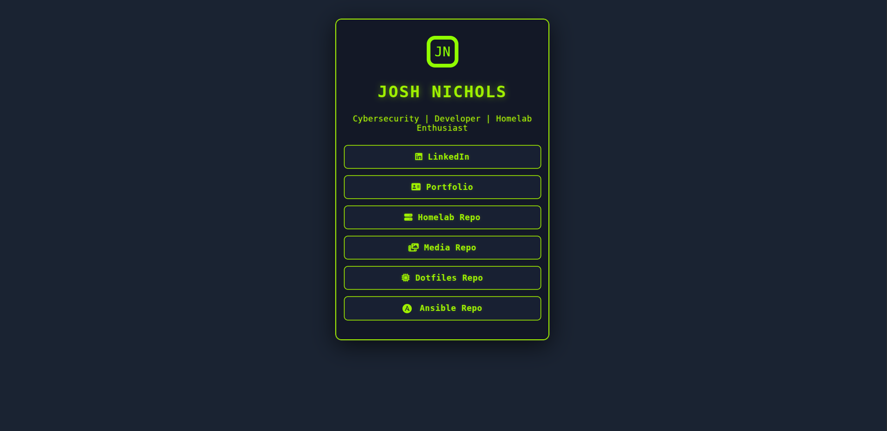

# 🟩 HTB-Themed Linktree Clone

A sleek, dark Linktree clone inspired by Hack The Box’s neon green, homelab, and cybersecurity vibes.  
Easily link all your key profiles and repositories—perfect for infosec enthusiasts!

---

## ⚡ Features

- **Hack The Box–inspired neon green & dark theme**
- Fully **responsive** (mobile-friendly)
- Customizable logo (SVG, initials, or images)
- FontAwesome & SVG tech/social icons
- Smooth hover, focus, and button animations
- One-file easy configuration

---

## 🚦 Preview





---

## 🛠️ Setup

1. **Clone the repo**  

```
git clone https://github.com/yourusername/htb-linktree-clone.git
cd htb-linktree-clone
```


2. **Edit your info**  
- Open `index.html`  
- Change your name, subtitle, and link URLs  
- (Optional) Update or replace the SVG logo with your initials or artwork

3. **Open in browser**  
- Double-click `index.html`  
- Or deploy with [GitHub Pages](https://pages.github.com) or any static host

---

## 🖌️ Customization

- **Colors:**  
Edit `style.css`—core palette includes:
- `--primary-bg`: #1a2332 (dark blue-gray)
- `--primary-accent`: #9FEF00 (neon green)
- `--primary-text`: #EBF4F5 (off-white)
- **Icons:**  
Uses [FontAwesome](https://fontawesome.com/) & SVG (for things like Ansible)
- **Logo:**  
Swap the SVG logo for your hacker/HTB-style mark!

---

## 📁 File Structure

```
htb-linktree-clone/
├── index.html
├── style.css
├── script.js # (optional, small logo animation)
└── README.md
```


---

## 🚀 Example: Add a New Link

Just add in `index.html`:

```
<a href="https://github.com/jcnichols22/Homelab" target="_blank"> <span> <i class="fa-solid fa-server"></i> Homelab Repo </span> </a> ``` You can copy/paste any FontAwesome icon or emoji!
```


## 🔒 Credits & Inspiration

- Aesthetic: Hack The Box (not affiliated)
- Icons: FontAwesome
- Base code: @jcnichols22